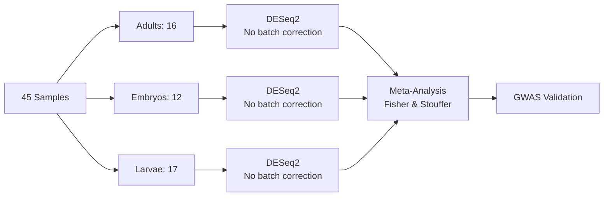
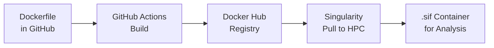

# Aedes albopictus Diapause RNA-seq Analysis

<div align="center">


**GWAS Candidate Gene Validation Through RNA-seq Analysis**

*Stage-specific differential expression analysis for validating diapause-associated genes*

[](https://hub.docker.com/r/cosmelab/albopictus-diapause-rnaseq)
[](https://github.com/cosmelab/albopictus-diapause-rnaseq/pkgs/container/albopictus-diapause-rnaseq)

**📊 Analysis:** 34 Candidate Genes | **🧬 Samples:** 45 | **🏗️ Architecture:** AMD64

</div>

---

## Project Overview

This project validates 34 GWAS-identified candidate genes for diapause regulation in *Aedes albopictus* (Asian tiger mosquito) using RNA-seq data from three independent studies representing different developmental stages.

### Research Design & Rationale

We leverage publicly available RNA-seq data from three studies, each examining a different developmental stage under diapause-inducing (8L:16D) versus non-diapause (16L:8D) photoperiod conditions:

<div align="center">

| BioProject | Stage | Platform | Samples | Diapause/Non | Publication |
|------------|-------|----------|---------|--------------|-------------|
| **PRJNA268379** | Adult females | Illumina HiSeq 2000 | 16 | 9/7 | Huang et al. 2015 |
| **PRJNA158021** | Embryos | Illumina HiSeq | 12 | 6/6 | Poelchau et al. 2013a |
| **PRJNA187045** | Pharate larvae | Illumina GA IIx | 17 | 8/9 | Poelchau et al. 2013b |

</div>

### Critical Analysis Consideration

**Complete Confounding:** Each developmental stage comes from a single study using a single sequencing platform. This creates 100% confounding between Platform, Stage, and Study, making traditional batch correction mathematically impossible. Our solution: analyze each stage independently (no batch correction needed within stage) and use meta-analysis to identify consistently regulated genes across stages.

---

## Analytical Strategy

### 1. Dual Quantification Approach

We employ both **Salmon** (pseudoalignment) and **featureCounts** (alignment-based) to:
- **Replicate collaborators' analyses:** Original studies used HTSeq; featureCounts provides comparable alignment-based counts
- **Leverage modern methods:** Salmon offers faster, more accurate transcript-level quantification
- **Validate consistency:** Achieved R² = 0.98 between methods, confirming robustness

### 2. Reference Genome & Annotation

- **Assembly:** *Aedes albopictus* AalbF3 (GCA_018104305.1)
- **Annotation:** Obtained from Dryad (doi:10.5061/dryad.mgqnk98z4)
  - Complete GFF3 with all feature types
  - Includes rRNA/tRNA annotations absent from NCBI
  - Required preprocessing for nf-core compatibility

### 3. Stage-Specific Analysis Pipeline



---

## Reproducibility Infrastructure

### Container-Based Analysis

All analyses execute within a Singularity container ensuring complete reproducibility:

```bash
# Container location on HPC
/bigdata/cosmelab/lcosme/projects/albopictus-diapause-rnaseq/albopictus-diapause-rnaseq.sif

# Example usage - ALWAYS use container
singularity exec --cleanenv --no-home albopictus-diapause-rnaseq.sif \
  Rscript scripts/06_differential_expression/03_adults_deseq2.R
```

**Container Contents:**
- R 4.4.3 (DESeq2, edgeR, tidyverse, metap)
- Python 3.10 (pandas, numpy, matplotlib, seaborn)
- Bioinformatics tools (STAR, Salmon, featureCounts, samtools)
- All dependencies version-locked

### Continuous Integration



**Critical Rule:** NEVER install software outside the container. Update Dockerfile and rebuild for new tools.

---

## Project Structure

```
albopictus-diapause-rnaseq/
├── README.md                           # This file
├── project_status_consolidated.md      # Current analysis status
├── stage_specific_analysis_roadmap.md  # Step-by-step analysis guide
├── critical_confounding_issue.md       # Explanation of study design constraints
├── lessons_learned.md                  # Critical project insights
├── technical.md                        # Infrastructure documentation
│
├── data/
│   ├── genome/                        # AalbF3 reference genome
│   ├── annotation/                    # Processed GTF files
│   ├── metadata/                      # Sample information
│   │   ├── samples.csv               # All 45 samples
│   │   ├── samples_adults.csv        # Adults only (16)
│   │   ├── samples_embryos.csv       # Embryos only (12)
│   │   └── samples_larvae.csv        # Larvae only (17)
│   └── collaborator_repos/            # Original analysis scripts
│
├── scripts/
│   ├── 01_data_acquisition/          # SRA & Dryad downloads
│   ├── 02_annotation_preprocessing/  # GTF fixes for nf-core
│   ├── 03_rnaseq_pipeline/          # nf-core/rnaseq v3.19.0
│   ├── 04_qc_analysis/              # QC extraction & visualization
│   ├── 05_batch_correction/         # ARCHIVED (impossible)
│   └── 06_differential_expression/  # Stage-specific DESeq2
│
├── results/
│   ├── count_matrices/               # Expression matrices
│   │   ├── salmon_gene_counts.tsv   # All 45 samples
│   │   ├── adults_counts.tsv        # Adults ready for DE
│   │   ├── embryos_counts.tsv       # Embryos ready for DE
│   │   └── larvae_counts.tsv        # Larvae ready for DE
│   ├── differential_expression/      # DE results per stage
│   ├── qc_figures/                  # Quality control plots
│   └── validation/                  # Method comparisons
│
├── output/                          # nf-core/rnaseq outputs
├── logs/                           # Computation logs
└── archived_docs/                  # Obsolete documentation
```

---

## Analysis Workflow

### Completed Steps ✅

1. **Reference Preparation**
   - Downloaded AalbF3 genome from Dryad
   - Converted GFF3 to GTF using gffread
   - Fixed 45 problematic transcripts
   - Added gene_biotype for featureCounts

2. **RNA-seq Processing** (October 18-19, 2025)
   - nf-core/rnaseq v3.19.0 pipeline
   - All 45 samples processed successfully
   - 5 hours runtime, 92.4% mean mapping rate

3. **Method Validation**
   - Salmon vs featureCounts: R² = 0.98
   - Confirms quantification robustness

4. **Data Preparation**
   - Count matrices split by developmental stage
   - Ready for stage-specific analyses

### In Progress 🔄

5. **Stage-Specific Differential Expression**
   - Priority: Adults (most relevant for GWAS)
   - Simple design: `~ Condition` (no batch correction)
   - Extract results for 34 GWAS candidates

### Upcoming 📋

6. **Meta-Analysis**
   - Fisher's combined probability test
   - Stouffer's weighted Z-score method

7. **Visualization & Manuscript**
   - Stage-specific volcano plots, MA plots, PCA
   - Cross-stage comparison heatmaps
   - Methods section with clear confounding explanation

---

## Quick Start Guide

### 1. Clone Repository
```bash
git clone https://github.com/cosmelab/albopictus-diapause-rnaseq.git
cd albopictus-diapause-rnaseq
```

### 2. Get Container
```bash
# On UCR HPC
module load singularity-ce/3.9.3

# Pull from Docker Hub
singularity pull albopictus-diapause-rnaseq.sif \
  docker://cosmelab/albopictus-diapause-rnaseq:latest
```

### 3. Run Stage-Specific Analysis
```bash
# Adults (priority for GWAS)
singularity exec --cleanenv albopictus-diapause-rnaseq.sif \
  Rscript scripts/06_differential_expression/03_adults_deseq2.R
```

---

## Key Documentation

### Essential Reading
1. **[stage_specific_analysis_roadmap.md](stage_specific_analysis_roadmap.md)** - Complete analysis pipeline
2. **[critical_confounding_issue.md](critical_confounding_issue.md)** - Why batch correction is impossible
3. **[project_status_consolidated.md](project_status_consolidated.md)** - Current progress

### Technical Documentation
- **[technical.md](technical.md)** - HPC setup, container management
- **[lessons_learned.md](lessons_learned.md)** - Critical insights (read before starting similar projects!)

---

## Computational Resources

- **HPC:** UCR HPCC, SLURM scheduler, epyc partition
- **Storage:** 5.8 TB project space
- **Pipeline runtime:** ~5 hours for 45 samples
- **DE analysis:** <30 minutes per stage

---

## Citation

```bibtex
@article{cosme2025diapause,
  title={Stage-specific differential expression reveals diapause-associated genes in Aedes albopictus},
  author={Cosme, L},
  journal={In preparation},
  year={2025}
}

# Original data sources:
@article{huang2015,
  title={Global transcriptome analysis of diapause in adult females},
  author={Huang, X and others},
  journal={BMC Genomics},
  year={2015}
}

@article{poelchau2013a,
  title={Embryonic diapause gene expression},
  author={Poelchau, MF and others},
  journal={J Insect Physiol},
  year={2013}
}

@article{poelchau2013b,
  title={Pharate larval transcriptome},
  author={Poelchau, MF and others},
  journal={BMC Genomics},
  year={2013}
}
```

---

## Contact

Dr. L. Cosme
University of California, Riverside
Entomology Department

---

*Last updated: October 21, 2025*